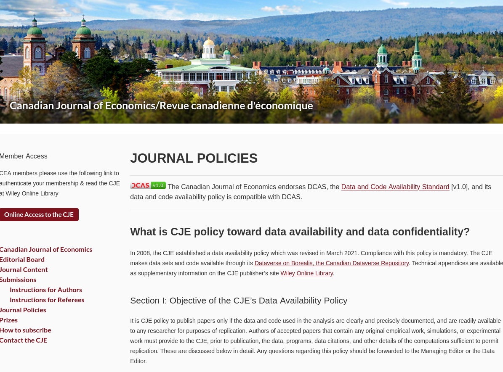
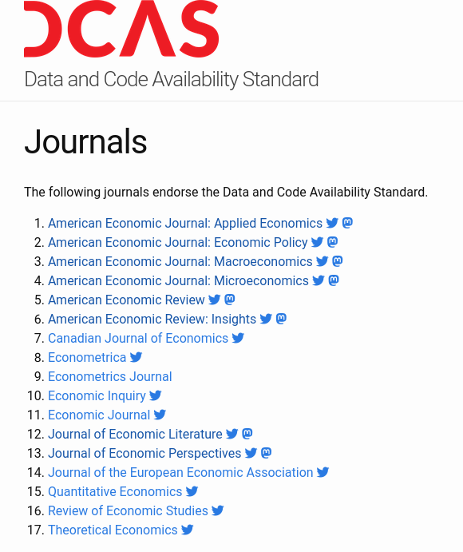

# What is... {background-image="images/lake-steaming.jpg" background-size="contain" background-position="bottom"}

## Reproducibility in Economics

## AEA Journals, Canada, and others

::::{.columns}

:::{.column width="50%"}

:::

:::{.column width="50%"}

:::
::::

## What is a replication package?

## A Replication Package is

- Code
- Data
- Materials (for surveys, experiments, ...)
- Instructions on how to obtain data not included
- Instructions on how to combine it all
- Known issues documented

## Complies with...

- [AEA Data and Code Availability policy](https://www.aeaweb.org/journals/data/data-code-policy)
- [Data and Code Availability Standard](https://datacodestandard.org/)  

## AEA policy

## Is stored in...

- [AEA Data and Code Repository](https://www.openicpsr.org/openicpsr/search/aea/studies)
- Other trusted repositories

## Tenets of the Policy

- **Transparency** 
- **Completeness** 
- **Preservation**

## Transparency

- Provenance of the *data*
- Processing of the data, from raw data to results (code)

> It is the policy of the American Economic Association to publish
papers only if the **data** used in the analysis are **clearly and precisely documented** and **access** to the data and code is **clearly and precisely documented** and is non-exclusive to the authors.

## Completeness

- All data needs to be identified and and access described
- All code needs to be described and provided 
- All materials must be provided (survey forms, etc.)

> Authors ... must provide, prior to acceptance, the
**data, programs, and other details** of the computations **sufficient** to
permit replication
 
## Preservation

- All *data* needs to be preserved for future replicators
  - Ideally, within the replication package, subject to ToU, for convenience
  - Otherwise, in a **trusted repository**

## Preservation

- *Code* must be in a trusted repository
  - Usually, within the replication package
  - Websites, Github, are *not acceptable*

## Historically

## Modern preservation

 
## Exceptions to the Policy

None

## ...

... there is a grey zone:

- When data do not belong to researcher, no control over preservation, access!
- Sometimes, *ToU* prevent researcher from revealing metadata (name of company, location)

## Transparency again

- However: 
  - No exception for need to **describe** access (own and other)
  - No exception for need to fully **describe** processing (possibly with redacted code)

# Reproducibility in Economics and beyond

## {background-image="images/socsci-webpage.png" background-size="contain"}

## Data Editors {.smaller}

::::{.columns}

:::{.column width="50%"}

- [American Economic Association](https://www.aeaweb.org/journals/) (8)
- [Econometric Society](https://www.econometricsociety.org/) (3)
- [Canadian Journal of Economics](https://www.economics.ca/cje-home) (1)
- [Royal Economic Society](https://res.org.uk/journals/) (2)
- [Western Economic Association International](https://weai.org/view/EI-Journal-Policies) (1)
- [European Economic Association](http://www.eeassoc.org/journal) (1)
- [Review of Economic Studies](https://www.restud.com/) (1)

:::

:::{.column width="50%"}

:::

::::

## Common policies {.smaller}

<https://social-science-data-editors.github.io/>

::::{.columns}

:::{.column width="50%"}

:::

:::{.column width="50%"}

:::

::::

## Elsewhere: Political Science {.smaller}

::::{.columns}

:::{.column width="50%"}

:::

:::{.column width="50%"}

:::

::::

## Elsewhere: Sociology {.smaller}

::::{.columns}

:::{.column width="50%"}

:::

:::{.column width="50%"}

:::

::::

## But!

## Elsewhere: Sociology {.smaller}

::::{.columns}

:::{.column width="50%"}

:::

:::{.column width="50%"}

 [^hdsr1]

[^hdsr1]:  Weeden, K. A. (2023). Crisis? What Crisis? Sociology’s Slow Progress Toward Scientific Transparency  . Harvard Data Science Review, 5(4). <https://doi.org/10.1162/99608f92.151c41e3>

:::

::::
