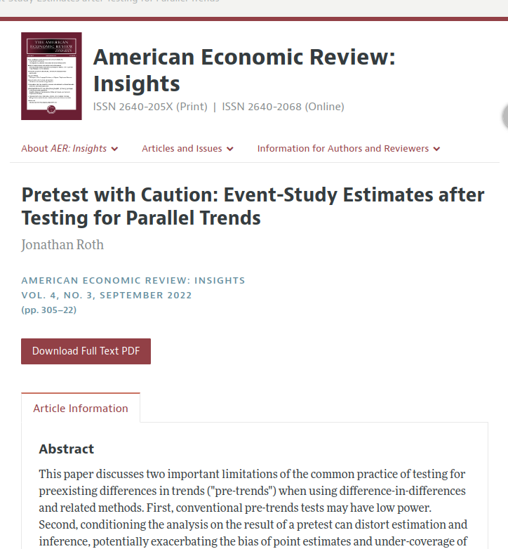
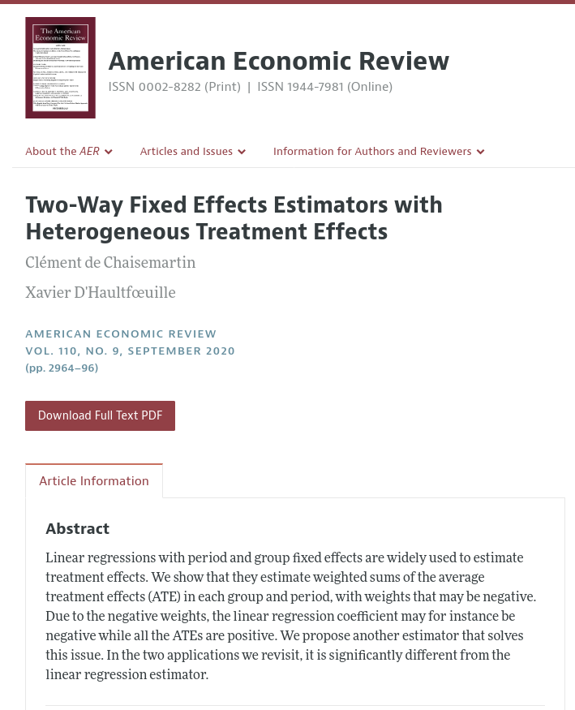

# Benefits of reproducible research

## Benefits to you

- Efficiency
- Trust that the results hold up to scrutiny
- Credibility

## Benefits to you

- More citations?

Jury is still out on this one, because too many confounding factors and too short a timeline.

## Benefits to you

- Ability by others to re-use
  - in education (classes)
  - in research (new papers)

## Benefits to others

- Ability to re-use (more efficiently)

## Building on the work of others

:::: {.columns}

::: {.column width="60%"}

Roth, Jonathan. 2022. "Pretest with Caution: Event-Study Estimates after Testing for Parallel Trends." American Economic Review: Insights 4 (3): 305–22. DOI: [10.1257/aeri.20210236](https://doi.org/10.1257/aeri.20210236)

Notes: "*I exclude 43 papers for which data to replicate the main event-study plot were unavailable.*"

:::

::: {.column width="40%"}

:::
::::

## Building on the work of others: dCdH 2020

:::: {.columns}

::: {.column width="60%"}

de Chaisemartin, Clément, and Xavier D'Haultfœuille. 2020. "Two-Way Fixed Effects Estimators with Heterogeneous Treatment Effects." American Economic Review 110 (9): 2964–96. DOI: [10.1257/aer.20181169](https://doi.org/10.1257/aer.20181169)

The results from various other papers are  recomputed to empirically demonstrate the relevance of the proposed methods.

:::

::: {.column width="40%"}

:::

::::

